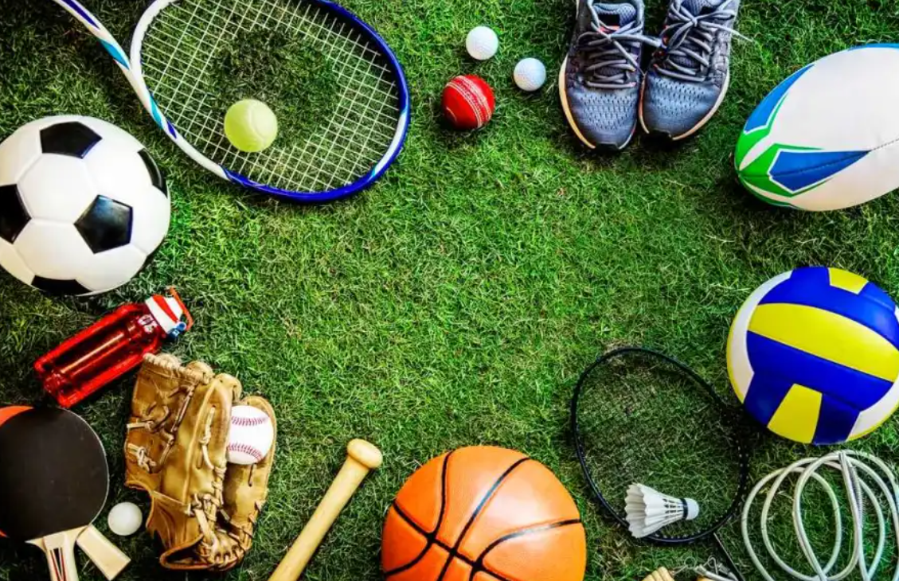
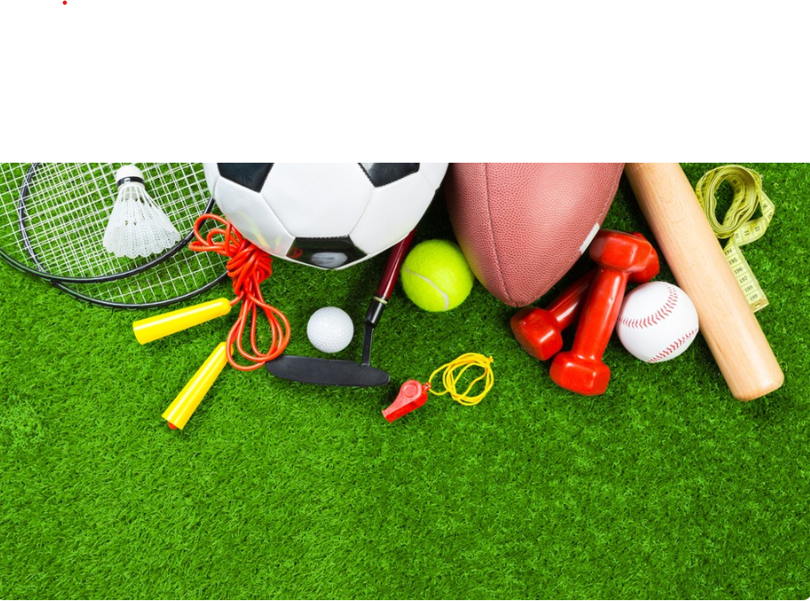

# 🏆 Sports Management System

### Revolutionizing Athlete Management in the Indian Sporting Industry

## 📌 Overview

The **Sports Management System** is a web-based platform designed to simplify athlete management, training monitoring, and performance tracking. It provides a centralized solution for athletes, coaches, academies, and sports organizations to manage sporting activities efficiently.

The platform aims to support the growth of Indian sports by digitizing athlete records, training schedules, and performance analysis.

---

## ✨ Features

### 👤 Athlete Management
- Athlete profile creation
- Personal and sports information management
- Achievement tracking

### 📈 Performance Tracking
- Record athlete performance data
- Monitor progress and statistics
- Analyze training outcomes

### 🏋️ Training Management
- Training schedules
- Workout tracking
- Coach recommendations

### 📋 Additional Services
- Sports-related resources
- Athlete development support
- Career growth opportunities

### 🔐 User Authentication
- Login functionality
- Secure access to athlete information

---

## 🛠️ Technologies Used

- HTML5
- CSS3
- JavaScript
- Responsive Web Design

---

## 📂 Project Structure

```text
Sports-Management/
│
├── INDEX.HTML
├── home.html
├── Login.html
├── Athlete.html
├── training.html
├── performance.html
├── Additional.html
├── styles.css
│
├── sport.png
├── sport2.png
├── sport3.png
│
└── README.md
```

---

## 🚀 How to Run

### Clone the Repository

```bash
git clone https://github.com/your-username/Sports-Management.git
```

### Run the Project

1. Open the project folder.
2. Open `INDEX.HTML` in any modern web browser.

---

## 🎯 Objectives

- Digitize athlete management processes.
- Improve performance tracking and monitoring.
- Organize training activities efficiently.
- Support coaches and sports organizations.
- Promote athlete development through technology.

---

## 🌟 Future Enhancements

- Database Integration
- AI-Based Performance Analysis
- Online Trial Registration
- Event & Tournament Management
- Athlete Ranking System
- Mobile Application Support

---

## 👥 Target Users

- Athletes
- Coaches
- Sports Academies
- Sports Organizations
- Talent Scouts
- Tournament Organizers

---

## 📸 Screenshots

### Home Page


### Athlete Management


### Performance Tracking


---

## 📜 License

This project is developed for educational and learning purposes.

---

### 🇮🇳 Empowering Athletes • Enhancing Performance • Transforming Indian Sports 🏅
